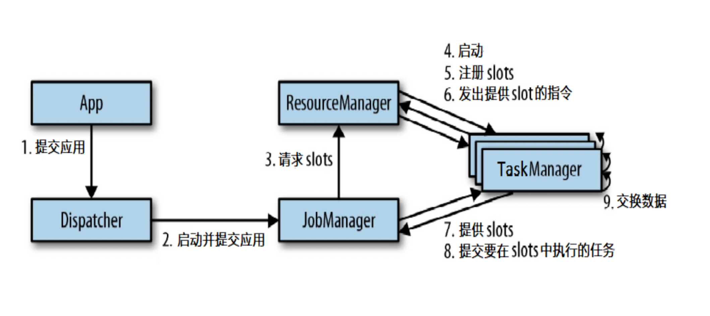
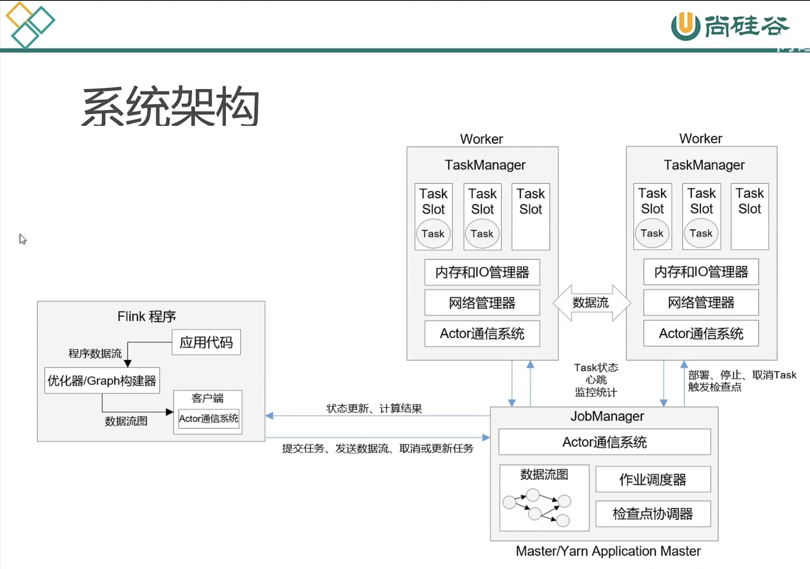
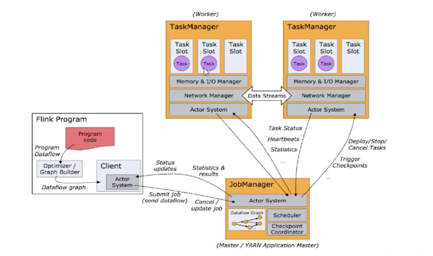
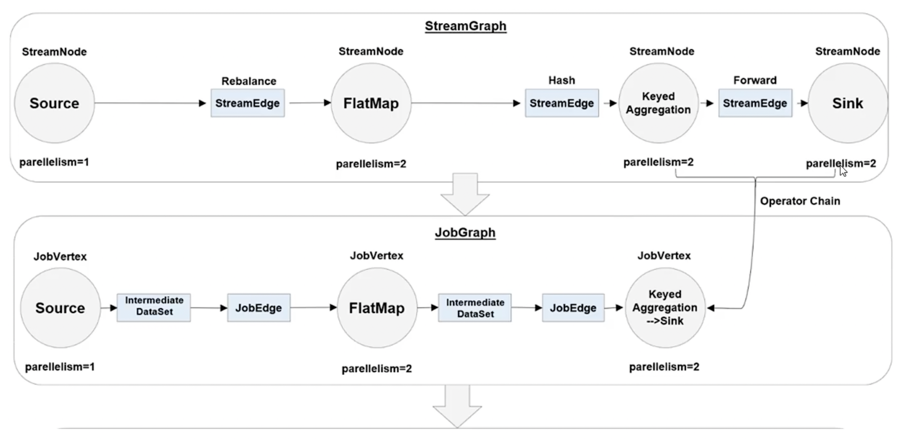
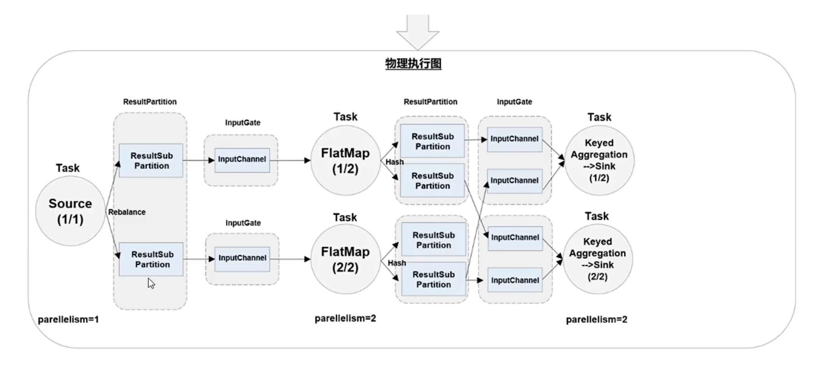
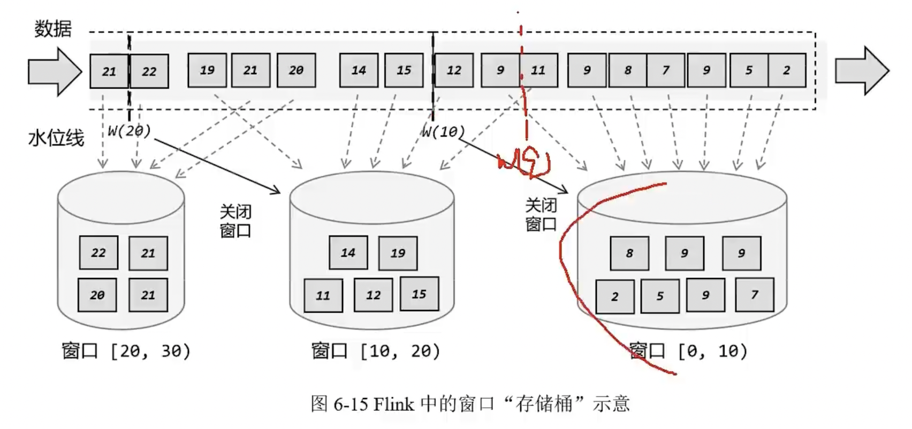

# Flink 随堂笔记

## 基本概念

事件驱动模型
利用观察者模式将数据库操作转化成流式操作
针对有界或无界数据流做有状态的计算

## 集群与配置

### 环境配置
+ Scala 2.12
+ Flink 1.15.2
+ 系统环境 Ubuntu 20 ARM 版
+ Java 11
+ Hadoop 3.3.4

### 集群配置
+ 配置集群节点服务器间时间同步 与 SSH免密登录
+ 自用同步脚本 并 关闭防火墙
+ 虚拟机三台服务器的具体设置如下
    + 节点服务器 1，IP 地址为 10.211.55.3，主机名为 hadoop101。
    + 节点服务器 2，IP 地址为 10.211.55.6，主机名为 hadoop102。
    + 节点服务器 3，IP 地址为 10.211.55.5，主机名为 hadoop103。

### 运行时架构

可以和Hadoop Yarn结合

### JobManager

#### 1. JobMaster
控制应用程序的主进程
数据流图 Dataflow Graph
作业图 Job Graph

#### 2. Resource Manager
管理slot
可以和其他平台集成

#### 3. Dispacher
提供REST接口

### TaskManager
主进程下的工作进程
工作进程下可能有多个slot
一个slot对应一个正真工作线程

将每个操作视为一个算子也比如 读、算、写

### 执行流程

## DataStream

### 算子

#### 1. source 原算子
读取数据输入

#### 2. transform
转换算子
+ map
    + 映射
    + 一对一映射转换
+ filter
    + 过滤
    + 符合条件的才转换
+ flatMap
    + 扁平映射
    + 对源数据做分散拆分再处理
    + 一对多的映射转换(可以是0)

聚合算子
+ keyBy
    + 根据 key 划分分区
+ reduce
    + 循环归约

自定义函数
+ UDF
+ 继承 Function

物理分区
+ 负载均衡分区
    + 轮询
    + 广播

#### 3. sink
输出算子
+ bucket
    + 先写到桶bucket中
    + bucket中分块写到目标存储

### 时间和窗口

#### 1. 处理时间
+ flink流接收到的时间

#### 2. 事件时间
+ 事件发生的时间
+ 水位线
    + 标识事件时间的进展
    + 就是将一系列事件发生时间做个标记
    + Flink 接收数据时标记点接收了数据才认为真的接收
    + 其实就是个有序的时间标记
+ 周期性的设置水位线
+ 通过延时机制保证更多的无序数据进入有序窗口

#### 3. 窗口
+ 一般根据时间分块
+ 看成 bucket 只保留指定范围内的数据
+ 可以根据计数分块

#### 4. 窗口分类
+ 滚动窗口
+ 滑动窗口
+ 会话窗口
+ 全局窗口
+ 触发器

### 分流合流
很好理解

### 状态
为了计算最终结果所需要的中间数据(节点)
#### 1. 按键分区状态(keyBy过来的)
+ 结构类型
    + 值
    + 列表
    + 映射
    + 归约
    + 聚合

#### 2. 算子状态
就是算子的值

#### 3. 广播状态
就是全局变量
应该是集群内唯一

#### 4. 持久化
+ Checkpoint
    + 某个时间点做快照(Snapshot)
    + 故障时可以恢复
    + [失败原因分析](https://cloud.tencent.com/developer/news/588940)
