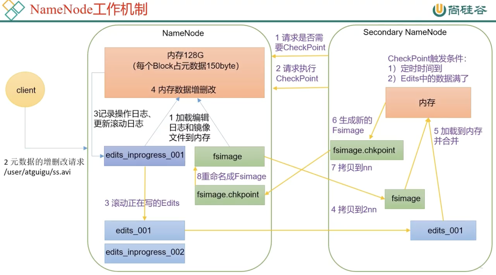
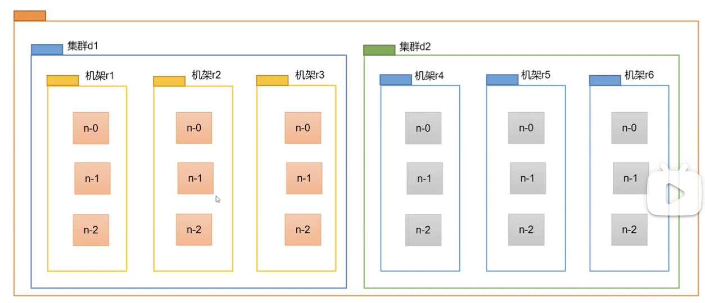
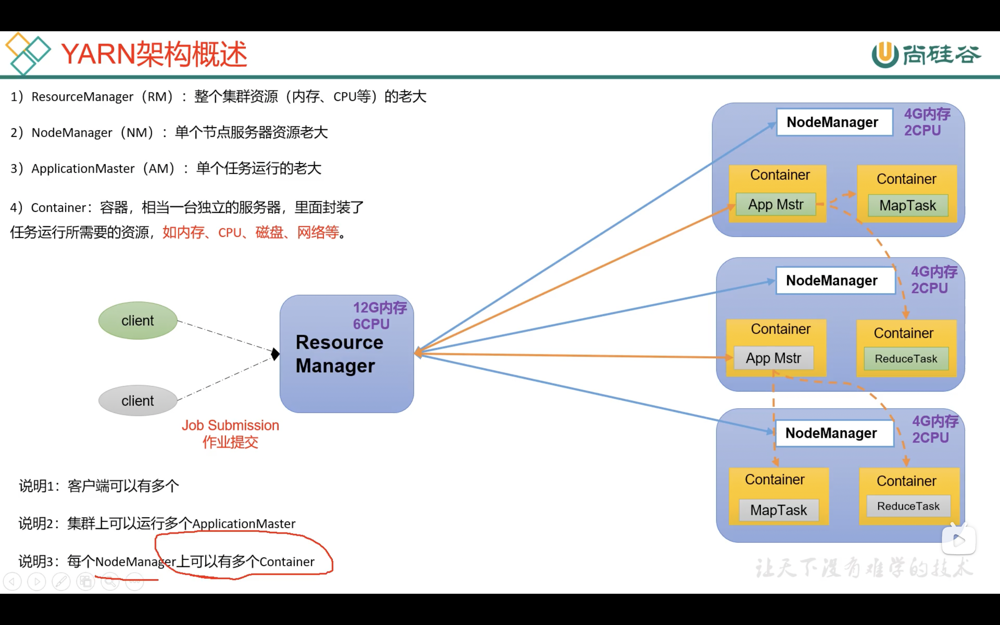
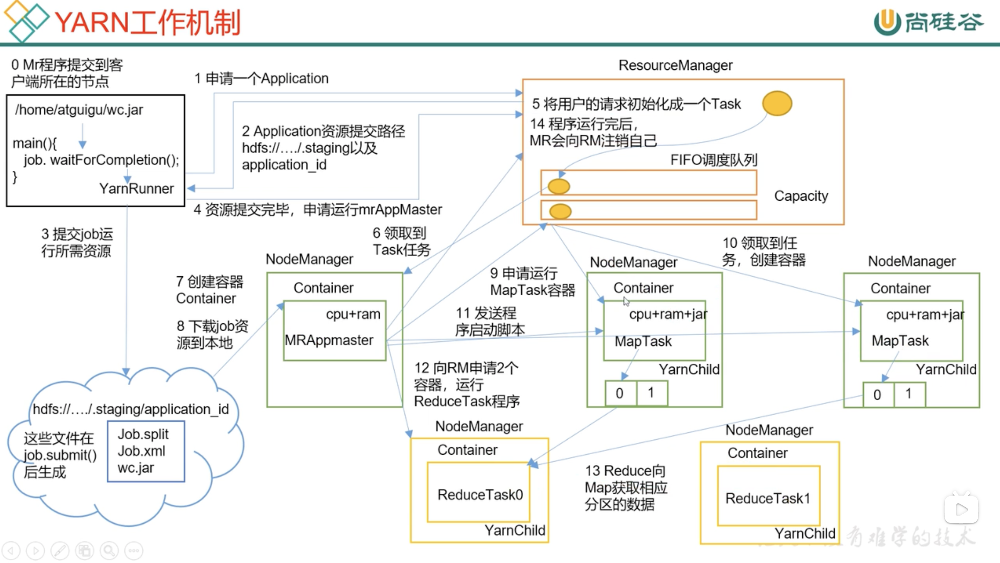
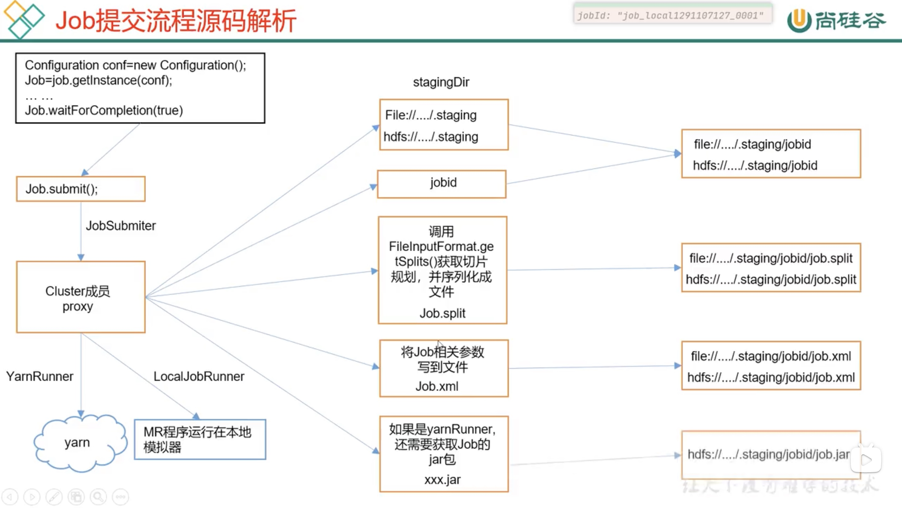

# Hadoop 随堂笔记


## HDFS
Hadoop Distributed File System
CP模型

### 文件块
128M一块
寻址时间为传输时间的1%时，为最佳状态
shell 命令和linux的文件命令很像

负载均衡 `hdfs diskbalancer`

性能调优
<!-- 45 46 47 -->
[yarn等调优方式](https://www.bilibili.com/video/BV1rL411E7uz?p=47)
每次遇到null会新增一个分区


### 结构
1. NameNode
+ Master 进程
+ 存储文件路径
+ 检查目录结构
+ 检查权限

#### 工作机制
+ 服务关闭时保存为镜像
+ 服务启动时加载磁盘中的镜像到内存里
+ 热数据在内存中保证较高效率(类似Redis)
+ 2NN服务(小秘)
    + 
    + Secondary NameNode(小秘) 没有最新增量
+ Fsimage
    + 永久性数据
+ Edits
    + 所有的更新操作操作
    + 可以认为是增量数据
    + 类似mysql的binlog 或 redis的AOF

2. DataNode
+ 具体数据流
    + packet数据包
+ 有自己的数据存储格式
+ 节点距离
    + 两个节点到达最近的共同祖先的距离总和
    + 

#### 工作机制
+ 块与块校验和定期向主节点反馈
+ 通过心跳机制保证连接的节点活着

## Yarn
Yet Another Resource Negotiator
管理 CPU 和内存

### 结构
+ ResourceManager
    + 集群资源管理
+ NodeManager
    + 单个节点管理
+ ApplicationMaster
    + 单个任务的Master进程
+ Container
    + 封装任务运行所需要的资源

### 架构图



### 工作机制




## MapReduce

### Map 与 Reduce
+ Map
并行处理输入数据

+ Reduce
对Map结果进行汇总

### MapTask
并行处理数据
切片大小等于块大小

+ Job



## 配置节点

```xml
<!-- core-site.xml -->
<configuration>
    <!-- 指定 NameNode 的地址 -->
    <property>
        <name>fs.defaultFS</name>
        <value>hdfs://hadoop102:8020</value>
    </property>
    <!-- 指定 hadoop 数据的存储目录 -->
    <property>
        <name>hadoop.tmp.dir</name>
        <value>/opt/module/hadoop-3.1.3/data</value>
    </property>
    <!-- 配置 HDFS 网页登录使用的静态用户为 atguigu -->
    <property>
        <name>hadoop.http.staticuser.user</name>
        <value>atguigu</value>
    </property>
</configuration>

<!-- hdfs-site.xml -->
<configuration>
    <!-- nn web 端访问地址-->
    <property>
        <name>dfs.namenode.http-address</name>
        <value>hadoop102:9870</value>
    </property>
    <!-- 2nn web 端访问地址-->
    <property>
        <name>dfs.namenode.secondary.http-address</name>
        <value>hadoop104:9868</value>
    </property>
</configuration>

<!-- yarn-site.xml -->
<configuration>
    <!-- 指定 MR 走 shuffle -->
    <property>
        <name>yarn.nodemanager.aux-services</name>
        <value>mapreduce_shuffle</value>
    </property>
    <!-- 指定 ResourceManager 的地址-->
    <property>
        <name>yarn.resourcemanager.hostname</name>
        <value>hadoop103</value>
    </property>
    <!-- 环境变量的继承 3.1.3 Bug-->
    <property>
        <name>yarn.nodemanager.env-whitelist</name>
        <value>JAVA_HOME,HADOOP_COMMON_HOME,HADOOP_HDFS_HOME,HADOOP_CO
NF_DIR,CLASSPATH_PREPEND_DISTCACHE,HADOOP_YARN_HOME,HADOOP_MAP
RED_HOME</value>
    </property>
</configuration>

<!-- mapred-site.xml -->
<configuration>
    <!-- 指定 MapReduce 程序运行在 Yarn 上 -->
    <property>
        <name>mapreduce.framework.name</name>
        <value>yarn</value>
    </property>
</configuration>

```

## 插件

1. hadoop-lzo
压缩插件
创建索引后支持切片

