# Hive 学习笔记

## 基本概念

+ Hive简介
    Hive是由Facebook开源，基于Hadoop的一个数据仓库工具，可以将结构化的数据文件映射为一张表，并提供类SQL查询功能。
+ Hive本质
    Hive是一个Hadoop客户端，用于将HQL（Hive SQL）转化成MapReduce程序。
    + Hive中每张表的数据存储在HDFS
    + Hive分析数据底层的实现是MapReduce（也可配置为Spark或者Tez）
    + 执行程序运行在Yarn上

### Hive 架构
1. 架构图

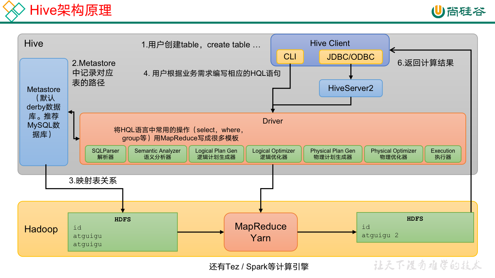

2. 架构组成
+ 用户接口：Client
    + CLI（command-line interface）、JDBC/ODBC。
+ 元数据：Metastore
    + 数据库（默认是default）、表名、表的拥有者、列/分区字段、表的类型（是否是外部表）、表的数据所在目录等。
    + 默认存储在自带的 derby 数据库中
    + 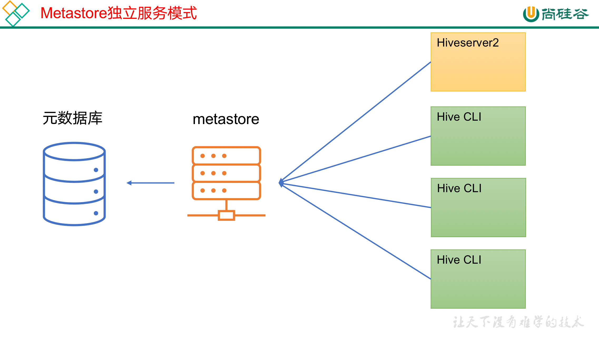

+ 驱动器：Driver
    + 解析器（SQLParser）：将SQL字符串转换成抽象语法树（AST）
    + 语义分析（Semantic Analyzer）：将AST进一步划分为QeuryBlock
    + 逻辑计划生成器（Logical Plan Gen）：将语法树生成逻辑计划
    + 逻辑优化器（Logical Optimizer）：对逻辑计划进行优化
    + 物理计划生成器（Physical Plan Gen）：根据优化后的逻辑计划生成物理计划
    + 物理优化器（Physical Optimizer）：对物理计划进行优化
    + 执行器（Execution）：执行该计划，得到查询结果并返回给客户端
+ Hadoop
    + 使用HDFS进行存储，可以选择MapReduce/Tez/Spark进行计算

3. 执行原理
+ 语法树

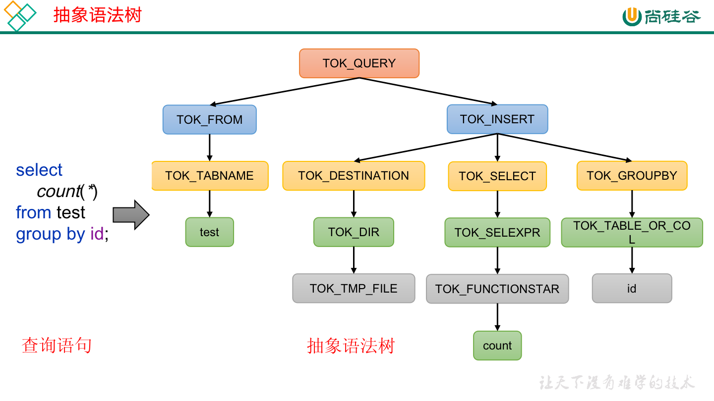

+ 执行顺序

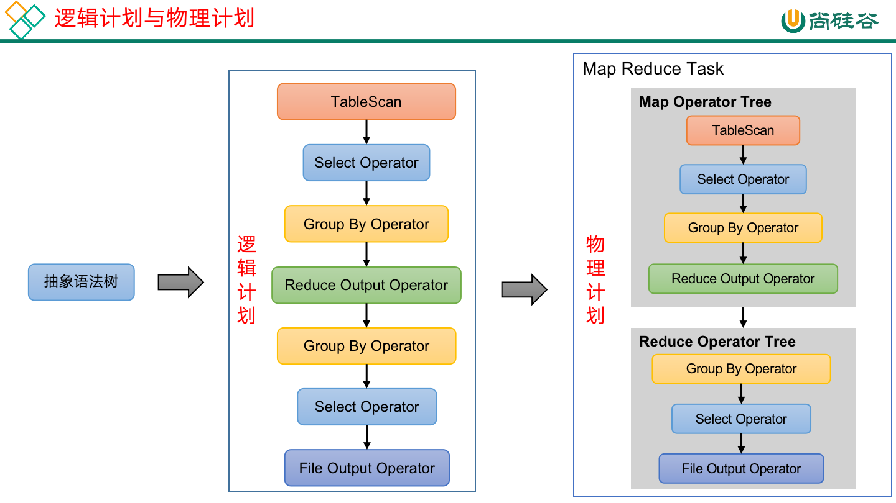

### Hive 配置
1. 需要配置derby

2. 配置hive
```xml
<!-- vim $HIVE_HOME/conf/hive-site.xml -->

<?xml version="1.0"?>
<?xml-stylesheet type="text/xsl" href="configuration.xsl"?>

<configuration>
    <!-- jdbc连接的URL -->
    <property>
        <name>javax.jdo.option.ConnectionURL</name>
        <value>jdbc:mysql://hadoop102:3306/metastore?useSSL=false</value>
    </property>

    <!-- jdbc连接的Driver-->
    <property>
    <name>javax.jdo.option.ConnectionDriverName</name>
        <value>com.mysql.jdbc.Driver</value>
    </property>

	<!-- jdbc连接的username-->
    <property>
        <name>javax.jdo.option.ConnectionUserName</name>
        <value>root</value>
    </property>

    <!-- jdbc连接的password -->
    <property>
        <name>javax.jdo.option.ConnectionPassword</name>
        <value>123456</value>
    </property>

    <!-- Hive默认在HDFS的工作目录 -->
    <property>
        <name>hive.metastore.warehouse.dir</name>
        <value>/user/hive/warehouse</value>
    </property>
</configuration>
```

3. 初始化 
`bin/schematool -dbType mysql -initSchema -verbose`

4. 客户端驱动
可以通过maven安装驱动包hive-jdbc-xxx.jar

### 启动脚本
```bash
#!/bin/bash

HIVE_LOG_DIR=$HIVE_HOME/logs
if [ ! -d $HIVE_LOG_DIR ]
then
	mkdir -p $HIVE_LOG_DIR
fi

#检查进程是否运行正常，参数1为进程名，参数2为进程端口
function check_process()
{
    pid=$(ps -ef 2>/dev/null | grep -v grep | grep -i $1 | awk '{print $2}')
    ppid=$(netstat -nltp 2>/dev/null | grep $2 | awk '{print $7}' | cut -d '/' -f 1)
    echo $pid
    [[ "$pid" =~ "$ppid" ]] && [ "$ppid" ] && return 0 || return 1
}

function hive_start()
{
    metapid=$(check_process HiveMetastore 9083)
    cmd="nohup hive --service metastore >$HIVE_LOG_DIR/metastore.log 2>&1 &"
    [ -z "$metapid" ] && eval $cmd || echo "Metastroe服务已启动"
    server2pid=$(check_process HiveServer2 10000)
    cmd="nohup hive --service hiveserver2 >$HIVE_LOG_DIR/hiveServer2.log 2>&1 &"
    [ -z "$server2pid" ] && eval $cmd || echo "HiveServer2服务已启动"
}

function hive_stop()
{
metapid=$(check_process HiveMetastore 9083)
    [ "$metapid" ] && kill $metapid || echo "Metastore服务未启动"
    server2pid=$(check_process HiveServer2 10000)
    [ "$server2pid" ] && kill $server2pid || echo "HiveServer2服务未启动"
}

case $1 in
"start")
    hive_start
    ;;
"stop")
    hive_stop
    ;;
"restart")
    hive_stop
    sleep 2
    hive_start
    ;;
"status")
    check_process HiveMetastore 9083 >/dev/null && echo "Metastore服务运行正常" || echo "Metastore服务运行异常"
    check_process HiveServer2 10000 >/dev/null && echo "HiveServer2服务运行正常" || echo "HiveServer2服务运行异常"
    ;;
*)
    echo Invalid Args!
    echo 'Usage: '$(basename $0)' start|stop|restart|status'
    ;;
esac
```


## 建表与数据导入

### DDL
（Data Definition Language）数据定义

1. 数据库
+ 创建数据库
`hive (default)> create database db_hive1;`
+ 查询数据库
`hive> show databases like 'db_hive*';`
+ 修改数据库
`hive> alter database db_hive3 set dbproperties ('create_date'='2022-11-20');`
+ 删除数据库
`hive> drop database db_hive2;`

2. 数据表
+ 创建表
```sql
create table if not exists student(
    id int, 
    name string
)
row format delimited fields terminated by '\t'
location '/user/hive/warehouse/student';
```
+ 查看表
`hive> show tables like 'stu*';`
+ 修改表
`hive (default)> alter table stu rename to stu1;`
+ 删除表
`hive (default)> drop table stu;`
+ 清空表
`hive (default)> truncate table student;`

### DML
（Data Manipulation Language）数据操作

1. Load
将文件导入到Hive表中。
`hive (default)> load data local inpath '/opt/module/datas/student.txt' into table student;`

2. Insert
+ 插入查询结果
```bash
hive (default)> insert overwrite table student3 
select 
    id, 
    name 
from student;
```
+ 插入指定值
```bash
hive (default)> insert into table  student1 values(1,'wangwu'),(2,'zhaoliu');
```

3. 导入导出
+ Import
```bash
hive> import table student2 from '/user/hive/warehouse/export/student';
```

+ Export
```bash
hive> export table default.student to '/user/hive/warehouse/export/student';
```

### 查询

1. 聚合查询
`hive (default)> select min(sal) min_sal from emp;`

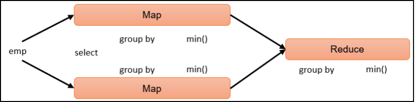

2. 分组查询
```bash
hive (default)>
select 
    t.deptno, 
    t.job, 
    max(t.sal) max_sal 
from emp t 
group by t.deptno, t.job;
```
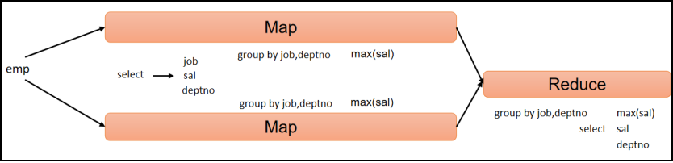

3. 连接查询
```bash
hive (default)> 
select 
    e.empno, 
    e.ename, 
    d.dname 
from emp e 
join dept d 
on e.deptno = d.deptno;
```


4. 排序
```bash
hive (default)> 
select 
    * 
from emp 
sort by deptno desc;
```
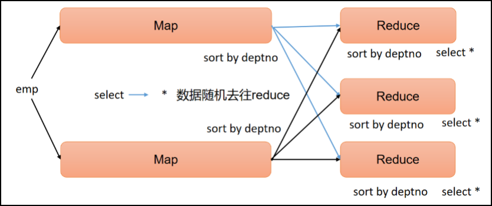

5. 分区查询
```bash
select 
    * 
from emp 
distribute by deptno 
sort by sal desc;
```
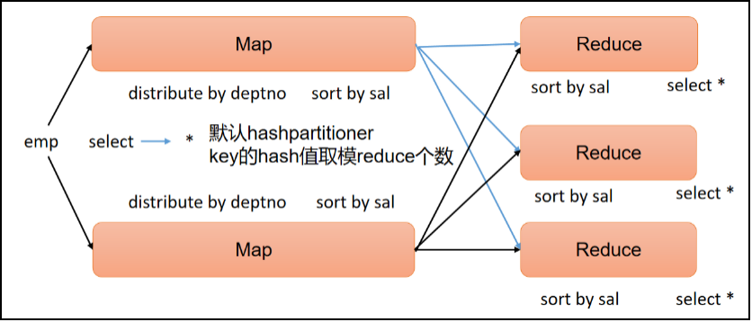

6. 分区排序
```bash
hive (default)> 
select 
    * 
from emp 
distribute by deptno 
sort by deptno;
```
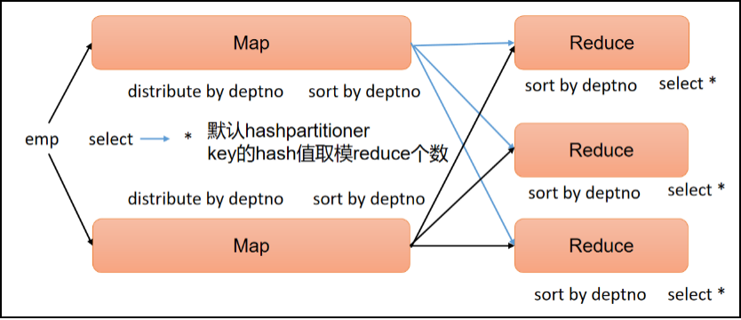

## 函数

### 普通函数
1. 查看函数
`hive> show functions;`

2. 查看用法
`hive> desc function upper;`

3. 查看函数详细信息
`hive> desc function extended upper;`

### 炸裂函数
UDTF(Table-Generating Functions)，接受一行数据,输出一行或多行数据

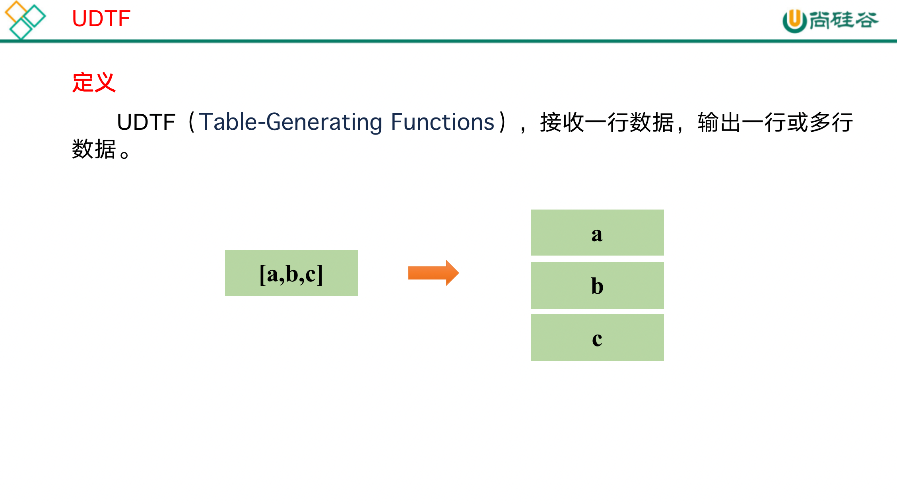

+ 示例
```sql
select
    cate,
    count(*)
from
(
    select
        movie,
        cate
    from
    (
        select
            movie,
            split(category,',') cates
        from movie_info
    )t1 lateral view explode(cates) tmp as cate
)t2
group by cate;
```

### 窗口函数
能为每行数据划分一个窗口，然后对窗口范围内的数据进行计算，最后将计算结果返回给该行数据。

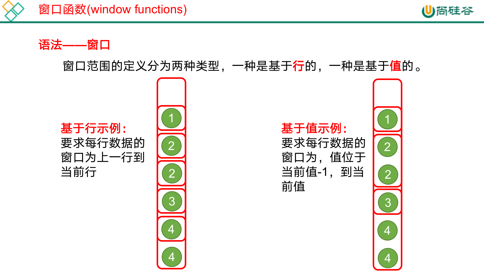

+ 示例

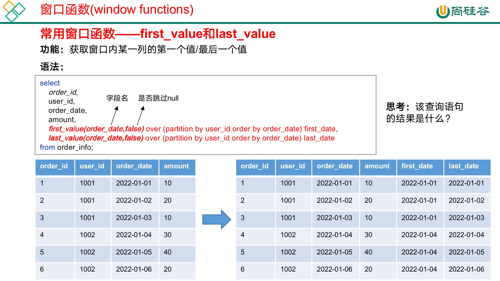

## 分区与分桶

### 分区表
Hive中的分区就是把一张大表的数据按照业务需要分散的存储到多个目录，每个目录就称为该表的一个分区。
在查询时通过where子句中的表达式选择查询所需要的分区，这样的查询效率会提高很多。

1. 创建分区表
```sql
create table dept_partition
(
    deptno int,    --部门编号
    dname  string, --部门名称
    loc    string  --部门位置
)
    partitioned by (day string)
    row format delimited fields terminated by '\t';

```

2. 查看所有分区信息
`hive> show partitions dept_partition;`

3. 创建分区
```bash
hive (default)> 
alter table dept_partition 
add partition(day='20220403');
```

4. 删除分区
```bash
hive (default)> 
alter table dept_partition 
drop partition (day='20220403');
```

5. 修复分区
```bash
hive (default)> 
msck repair table table_name [add/drop/sync partitions];
```

6. 二级分区
```sql
create table dept_partition2(
    deptno int,    -- 部门编号
    dname string, -- 部门名称
    loc string     -- 部门位置
)
partitioned by (day string, hour string)
row format delimited fields terminated by '\t';
```

### 分桶表
分区提供一个隔离数据和优化查询的便利方式。不过，并非所有的数据集都可形成合理的分区。
对于一张表或者分区，Hive 可以进一步组织成桶，也就是更为细粒度的数据范围划分，分区针对的是数据的存储路径，分桶针对的是数据文件。
分桶表的基本原理是，首先为每行数据计算一个指定字段的数据的hash值，然后模以一个指定的分桶数，最后将取模运算结果相同的行，写入同一个文件中，这个文件就称为一个分桶（bucket）。

1. 创建分桶表
```sql
create table stu_buck_sort(
    id int, 
    name string
)
clustered by(id) sorted by(id)
into 4 buckets
row format delimited fields terminated by '\t';
```

2. 数据导入分桶
```bash
hive (default)> 
load data local inpath '/opt/module/hive/datas/student.txt' 
into table stu_buck;
```


## 调优策略

### 压缩
1. 主流压缩方式
| 压缩格式 | 算法    | 文件扩展名 | 是否可切分 |
| -------- | ------- | ---------- | ---------- |
| DEFLATE  | DEFLATE | .deflate   | 否         |
| Gzip     | DEFLATE | .gz        | 否         |
| bzip2    | bzip2   | .bz2       | 是         |
| LZO      | LZO     | .lzo       | 是         |
| Snappy   | Snappy  | .          | 否         |

2. ORC
ORC（Optimized Row Columnar）file format是Hive 0.11版里引入的一种列式存储的文件格式。
ORC文件能够提高Hive读写数据和处理数据的性能。


3. Parquet
Parquet文件是Hadoop生态中的一个通用的文件格式，它也是一个列式存储的文件格式。

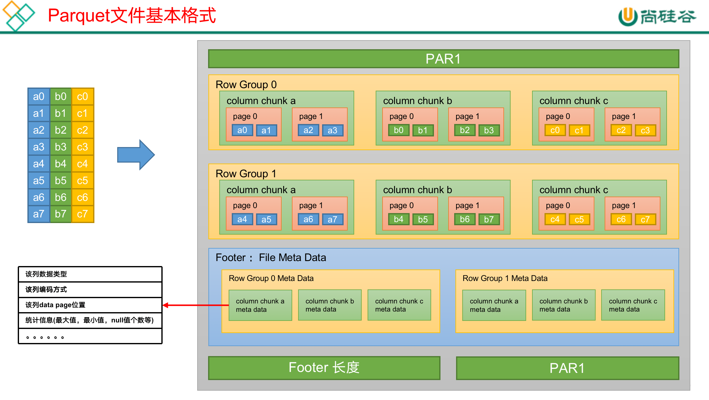


### 语句优化
1. Explain
分析执行
```sql
explain
select
    user_id,
    count(*)
from order_detail
group by user_id; 
```

2. 聚合语句优化
```conf
--启用map-side聚合，默认是true
set hive.map.aggr=true;

--用于检测源表数据是否适合进行map-side聚合。检测的方法是：先对若干条数据进行map-side聚合，若聚合后的条数和聚合前的条数比值小于该值，则认为该表适合进行map-side聚合；否则，认为该表数据不适合进行map-side聚合，后续数据便不再进行map-side聚合。
set hive.map.aggr.hash.min.reduction=0.5;

--用于检测源表是否适合map-side聚合的条数。
set hive.groupby.mapaggr.checkinterval=100000;

--map-side聚合所用的hash table，占用map task堆内存的最大比例，若超出该值，则会对hash table进行一次flush。
set hive.map.aggr.hash.force.flush.memory.threshold=0.9;
```

3. Map Join 语句优化
```conf
--启动Map Join自动转换
set hive.auto.convert.join=true;

--一个Common Join operator转为Map Join operator的判断条件,若该Common Join相关的表中,存在n-1张表的已知大小总和<=该值,则生成一个Map Join计划,此时可能存在多种n-1张表的组合均满足该条件,则hive会为每种满足条件的组合均生成一个Map Join计划,同时还会保留原有的Common Join计划作为后备(back up)计划,实际运行时,优先执行Map Join计划，若不能执行成功，则启动Common Join后备计划。
set hive.mapjoin.smalltable.filesize=250000;

--开启无条件转Map Join
set hive.auto.convert.join.noconditionaltask=true;

--无条件转Map Join时的小表之和阈值,若一个Common Join operator相关的表中，存在n-1张表的大小总和<=该值,此时hive便不会再为每种n-1张表的组合均生成Map Join计划,同时也不会保留Common Join作为后备计划。而是只生成一个最优的Map Join计划。
set hive.auto.convert.join.noconditionaltask.size=10000000;
```

### 性能优化
1. 数据倾斜
如果group by分组字段的值分布不均，就可能导致大量相同的key进入同一Reduce，从而导致数据倾斜问题。

2. 并行度
```conf
--指定Reduce端并行度，默认值为-1，表示用户未指定
set mapreduce.job.reduces;
--Reduce端并行度最大值
set hive.exec.reducers.max;
--单个Reduce Task计算的数据量，用于估算Reduce并行度
set hive.exec.reducers.bytes.per.reducer;
```

3. 小文件合并
将多个小文件划分到一个切片中，进而由一个Map Task去处理。目的是防止为单个小文件启动一个Map Task，浪费计算资源。

4. 谓词下推
谓词下推（predicate pushdown）是指，尽量将过滤操作前移，以减少后续计算步骤的数据量。

5. CBO与JVM调参
数据的行数、CPU、本地IO、HDFS IO、网络IO等方面的优化设置
JVM相关资源优化
