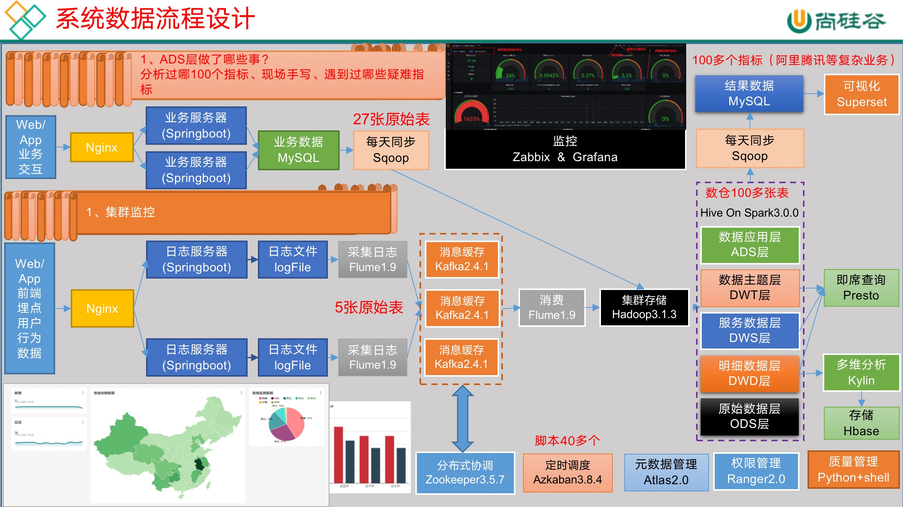
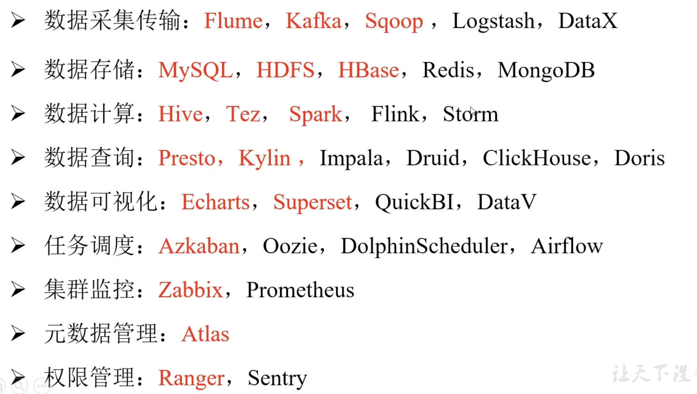
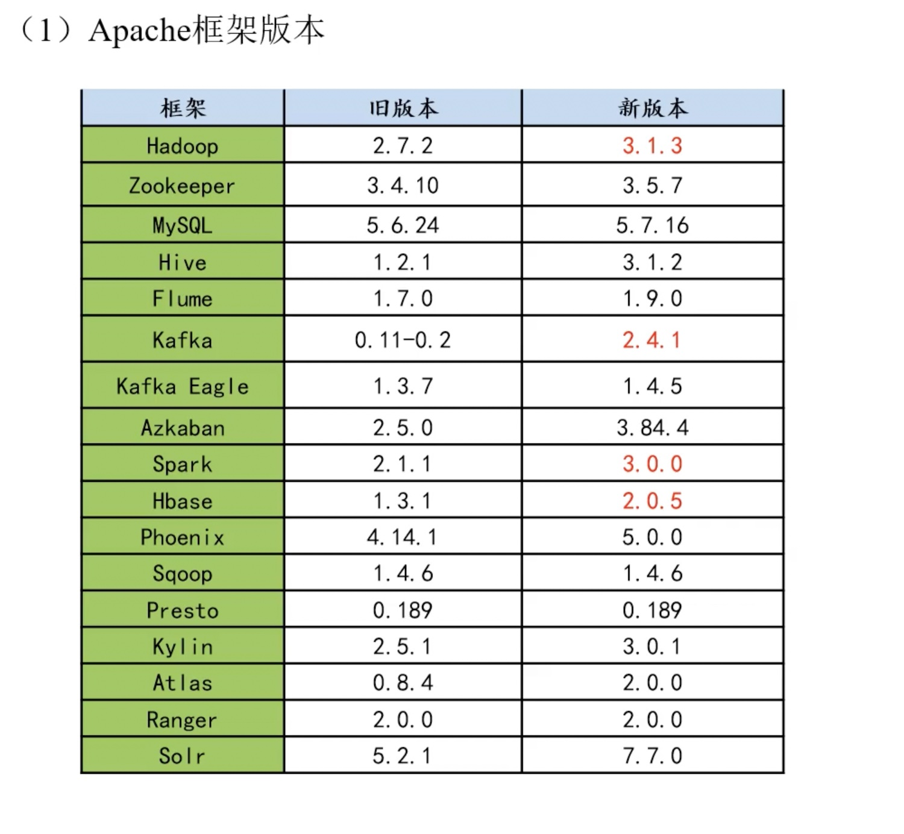
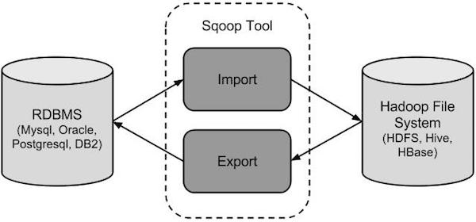
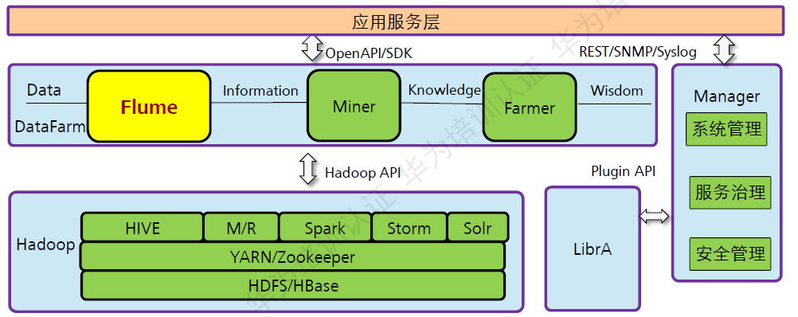
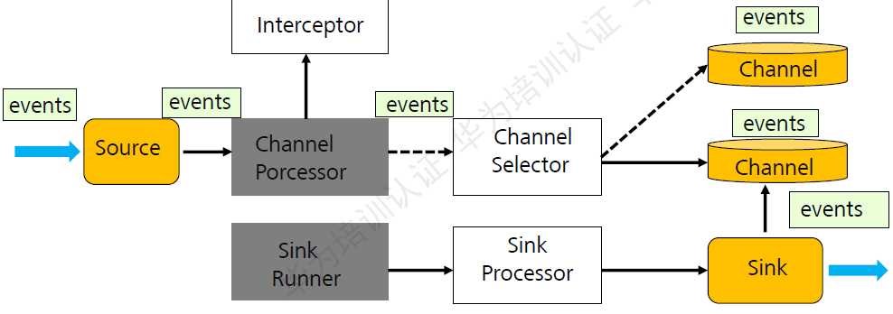
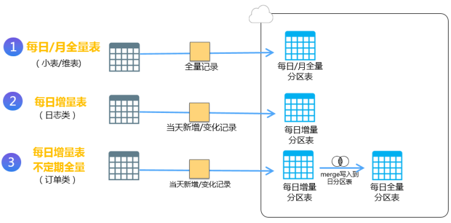

# 大数据与数仓随堂笔记

## 基本概念
数据仓库（ Data Warehouse ），是为企业制定决策，提供数据支持的。
可以帮助企业，改进业务流程、提高产品质量等。

### 按数据类型分类
1. 业务数据
就是各行业在处理事务过程中产生的数据。比如用户在电商网站中登录、下单、支付等过程中，需要和网站后台数据库进行增删改查交互，产生的数据就是业务数据。

2. 用户行为数据
用户在使用产品过程中，通过埋点收集与客户端产品交互过程中产生的数据，并发往日志服务器进行保存。比如页面浏览、点击、停留、评论、点赞、收藏等。

3. 爬虫数据
通常事通过技术手段获取其他公司网站的数据。不建议同学们这样去做。

## 技术架构

+ 整体架构图

+ 相关技术概览

+ 版本选择

### 硬件资源

1. 资源计算

利用压测验证计算结果

2. 集群规划
+ 消耗内存的分开
+ 数据传输数据比较紧密的放在一起（Kafka 、Zookeeper）
+ 客户端尽量放在一到两台服务器上，方便外部访问
+ 有依赖关系的尽量放到同一台服务器（Hive、Mysql、Spark、Azkaban）

## 数据生成模块

### 目标数据
我们要收集和分析的数据主要包括页面数据、事件数据、曝光数据、启动数据和错误数据。

1. 页面数据
页面数据主要记录一个页面的用户访问情况，包括访问时间、停留时间、页面路径等信息。
2. 事件数据
事件数据主要记录应用内一个具体操作行为，包括操作类型、操作对象、操作对象描述等信息。
3. 曝光数据
曝光数据主要记录页面所曝光的内容，包括曝光对象，曝光类型等信息。
4. 启动数据
应用的启动信息。
5. 错误信息

### 数据埋点
埋点就是记录用户信息

> 埋点上报时机选择
+ 在离开该页面时，上传在这个页面产生的所有数据（页面、事件、曝光、错误等）。
    + 优点，批处理，减少了服务器接收数据压力。
    + 缺点，不是特别及时。
+ 每个事件、动作、错误等，产生后，立即发送。
    + 优点，响应及时。
    + 缺点，对服务器接收数据压力比较大。

## 数据采集

### HDFS存储
1. 节点数据平衡
<!-- 集群中各个节点的磁盘空间利用率相差不超过10% -->
`start-balancer.sh -threshold 10`

2. 磁盘间数据平衡
`hdfs diskbalancer`

3. 数据压缩
创建lzo索引
`hadoop-lzo`

4. 基准测试
HDFS读写性能测试
`TestDFSIO`

### 相关工具
1. Sqoop
Sqoop是Hadoop和关系数据库服务器之间传送数据的一种工具。
它是用来从关系数据库如：MySQL，Oracle到Hadoop的HDFS，并从Hadoop的文件系统导出数据到关系数据库。

2. Flume
Flume 是Cloudera 提供的一个高可用的，高可靠的，分布式的海量日志采集、聚合和传输的系统。Flume 基于流式架构，灵活简单。
+ 处于hadoop中的应用层

+ Flume架构图

3. DataX
由阿里维护，有社区功能比较完善

4. 自定义
可以基于Spark编写自定义数据拉取脚本
可以使用其他更好的方法

### 同步策略
1. 全量同步
每日全量，就是每天存储一份完整数据，作为一个分区。
适用于表数据量不大，且每天既会有新数据插入，也会有旧数据的修改的场景。

2. 增量同步
每日增量，就是每天存储一份增量数据，作为一个分区。
适用于表数据量大，且每天只会有新数据插入的场景。

### 每日同步脚本
利用`相关工具`编写脚本做到每日同步拉取
可以配合调度工具如 Airflow、Azkaban 做到流式
流式可以让任务更加清晰

## 离线数仓建模(DW)与分层
将复杂的任务分解成多层来完成，每一层只处理简单的任务，方便定位问题。
规范数据分层，通过的中间层数据，能够减少极大的重复计算，增加一次计算结果的复用性。
不论是数据的异常还是数据的敏感性，使真实数据与统计数据解耦开。
本质上是利用离散数学范式降低数据的冗余

### 范式
1. 第一范式
每个字段属性不可再切分

2. 第二范式
不能存在部分函数依赖

3. 第三范式
不能存在传递函数依赖

4. 可以使用PowerDesign等建模工具

### ODS(Operation Data Store)
原始数据，此层保存原始数据，并且备份，备份时可以压缩。
一般来说和原表结构一致

### DIM(Dimension)
维度表与事实表想对应，一般表示一个抽象的公共性大的表
主键作为事实表的外键

### DWD(Data Warehouse Detail)
业务事实表 表示某个业务的具体实现
通过外键寻找维度表表示其信息 这样符合第三范式
数据清洗，脱敏，维度退化。

### DWS(Data Warehouse Summary)
DWS层就是关于各个主题的加工和使用，是宽表聚合值。
和维度表对“赤尻马猴”

应 对应一天的维度
而主题的目的用来做某种具体功能

### DWT(Data Warehouse Topic)
和DWS同，不过DWS层单位是日，而DWT是对截止到当日、或者近7日、近30日的汇总。
更加具体的聚合
和维度表对应 对应历史维度 N天的维度

### ADS(Application Data Store)
给应用层调用用 为某一项具体功能
方便对接平台API对接

## 数据抽取

### 全量抽取
全量抽取是将数据源中的表或视图的数据原封不动的从数据库中抽取出来，并写入到Hive、MaxCompute等大数据平台中，有点类似于业务库之间的数据迁移。

全量同步比较简单，常用于小数据量的离线同步场景。不过这种同步方法，也有两个弊端，与增量离线同步一模一样：
+ 只能获取最新的状态
+ 会丢失已经被delete的记录

### 增量抽取
用时间戳方式抽取增量数据很常见，业务系统在源表上新增一个时间戳字段，创建、修改表记录时，同时修改时间戳字段的值。 抽取任务运行时，进行全表扫描，通过比较抽取任务的业务时间、时间戳字段来决定抽取哪些数据。

此种数据同步方式，在准确率方面有两个弊端：
+ 只能获取最新的状态，无法捕获过程变更信息，比如电商购物场景，如果客户下单后很快支付，隔天抽取增量数据时，只能获取最新的支付状态，下单时的状态有可能已经丢失。针对此种问题，需要根据业务需求来综合判定是否需要回溯状态。
+ 会丢失已经被delete的记录。如果在业务系统中，将记录物理删除。也就无法进行增量抽取。一般情况下，要求业务系统不删除记录，只对记录进行打标。

### 拉链抽取
所谓拉链，就是记录历史
+ 记录一个事物从开始，一直到当前状态的所有变化的信息。
+ 我们可以使用这张表拿到最新的当天的最新数据以及之前的历史数据。
+ 既能满足反应数据的历史状态，又可以最大限度地节省存储空间

#### MySQL binlog
解析binlog日志，给数据同步带来了新的方法，将解析之后结果发送到Hive/MaxCompute等大数据平台，实现秒级延时的数据同步。

解析binlog日志增量同步方式技术很先进，有3个非常大的优点：
1.数据延时小。在阿里巴巴双11场景，在巨大的数据量之下，可以做到秒级延时;
2.不丢失数据，可以捕获数据delete的情形；
3.对业务表无额外要求，可以缺少时间戳字段；

#### Oracle Redo Log
Oracle是功能非常强大的数据库，通过Oracle GoldenGate实时解析Redo Log日志，并将解析后的结果发布到指定的系统

### 数据抽取架构

